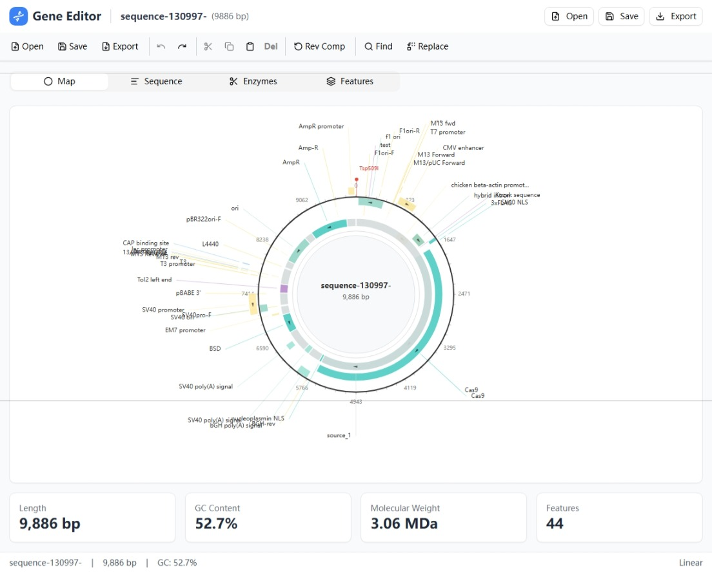
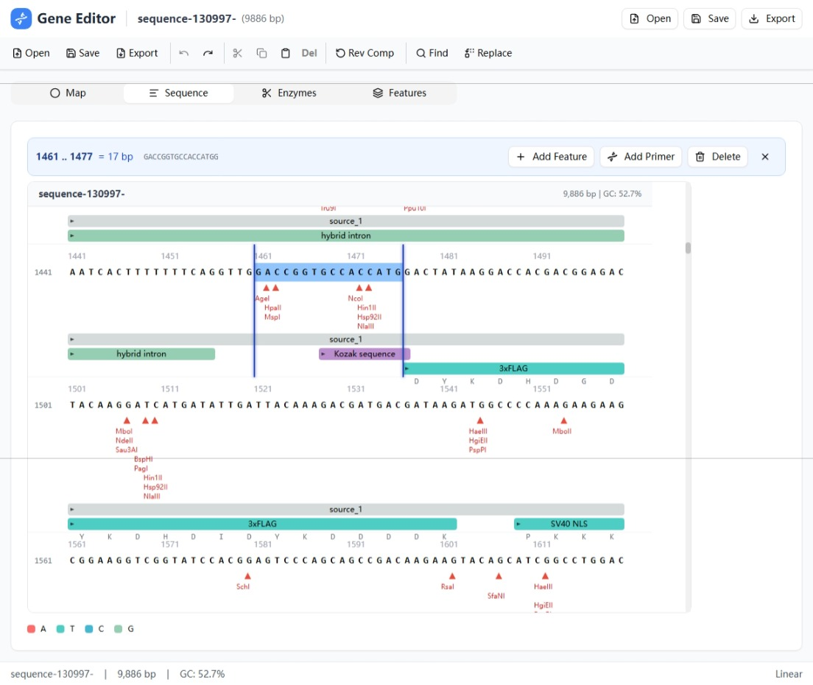

# Gene Editor

一个由KIMI 2.5 模型生成的DNA序列查看和编辑工具，专为分子生物学研究设计。支持环形质粒可视化、限制酶分析、序列编辑等功能。

## 界面预览

### 环形质粒图谱 (Map View)


### 线性序列视图 (Sequence View)


## 功能特性

### 🔬 DNA序列可视化
- **环形质粒图 (Circular Plasmid Map)** - 使用D3.js绘制的交互式质粒图谱
- **线性序列视图 (Linear Sequence)** - 清晰的DNA序列展示，支持多行显示
- **特征标注 (Features)** - 自动识别和可视化基因、CDS、启动子等特征
- **限制酶位点 (Enzymes)** - 自动检测并标注200+种常用限制酶位点

### 📝 序列编辑
- 创建新序列（支持线性/环状）
- 序列剪切、复制、粘贴
- 删除选定区域
- 反转互补序列
- 查找和替换功能
- 撤销/重做支持

### 📁 文件支持
- **导入**: GenBank (.gb, .gbk) 文件
- **导出**: GenBank 格式
- **导出**: FASTA 格式

### 📊 序列分析
- 序列长度统计
- GC含量计算
- 分子量估算
- 支持200+种常见限制酶

## 技术栈

- **React 19** - UI框架
- **TypeScript** - 类型安全
- **Vite** - 构建工具
- **Tailwind CSS** - 样式
- **Radix UI** - 基础UI组件
- **D3.js** - 数据可视化
- **Lucide React** - 图标

## 开始使用

### 安装依赖

```bash
npm install
```

### 启动开发服务器

```bash
npm run dev
```

### 构建生产版本

```bash
npm run build
```

### 预览生产构建

```bash
npm run preview
```

## 使用指南

### 打开文件
1. 点击首页的 "Open GenBank File" 或工具栏的 "Open" 按钮
2. 选择 .gb 或 .gbk 格式的GenBank文件

### 创建新序列
1. 点击 "New Sequence"
2. 输入序列名称和DNA序列
3. 选择是否为环状质粒
4. 点击 "Create Sequence"

### 视图切换
- **Map** - 环形质粒图谱视图
- **Sequence** - 线性序列视图
- **Enzymes** - 限制酶位点列表
- **Features** - 特征列表

### 编辑操作
- 在序列视图中拖拽选择区域
- 选择后显示操作栏：Add Feature / Add Primer / Delete
- 点击 X 按钮清除选择

## 支持的特征类型

- gene, CDS, exon, intron
- promoter, terminator, enhancer
- rep_origin (复制起点)
- primer_bind (引物结合位点)
- misc_feature, misc_binding
- tRNA, rRNA, mRNA, ncRNA
- 5'UTR, 3'UTR
- LTR, repeat_region
- 以及更多...

## 限制酶库

内置200+种常用限制酶，包括：
- EcoRI, BamHI, HindIII, XhoI, XbaI
- KpnI, SacI, PstI, SmaI, SalI
- NotI, NcoI, BglII, ClaI
- 等等...

## 浏览器支持

- Chrome (推荐)
- Firefox
- Safari
- Edge

## 许可证

MIT License

## 致谢

本项目受 [SnapGene](https://www.snapgene.com/) 启发，使用KIMI v2.5 生成、调试代码。为科研工作者提供免费的DNA序列编辑工具。
